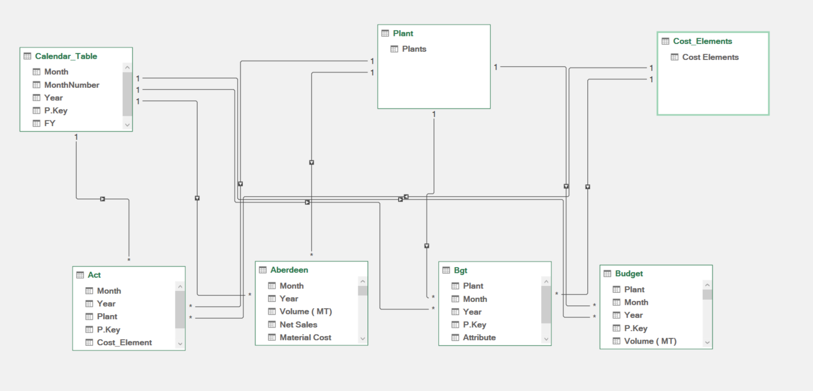
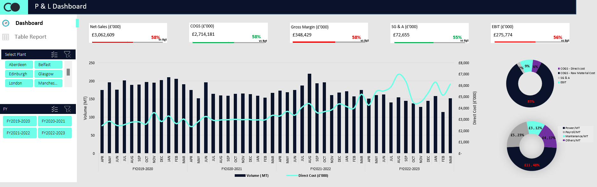

# Company Overview
Cocoon Ventures is a leading flour milling company in the United Kingdom, with a rich history and a commitment to excellence. Their network of state-of-the-art mills spans the country, producing a wide range of high-quality flours for the baking industry. With a legacy of over 20 years in the flour milling industry, Cocoon Ventures has grown from a single mill to a national presence, while remaining true to its core values. Their experienced team, advanced facilities, and dedication to quality have earned her a reputation as a trusted partner for bakers and food manufacturers across the UK.

## Problem statement
Wheat flour is an important bedrock of the UK diet. This single ingredient is in about a third of all grocery products on supermarket shelves and provides 20% of the energy and protein consumed by the UK population. Additionally, flour makes a significant contribution to vitamin and mineral intake providing much of the fibre, calcium (great news for vegans) and iron (more great news for vegans) consumed in the UK. Flour is an ingredient with much to offer. The quantities of flour milled and consumed in the UK each day are vast. About 12 million loaves of bread, 2 million pizzas, and 10 million cakes and biscuits are made in Britain every day. Furthermore, data from Kantar shows that bread is purchased by more UK households than any other product. 

Cocoon Ventures faces the daunting task of maintaining profitability amidst escalating production costs, soaring inflation rates, and rising energy prices. With the added pressures of fluctuating raw material costs, intense market competition, and increasing regulatory requirements, how can the company optimize its operational efficiency, pricing strategies, and investment decisions to minimize the impact of these challenges on its financial performance, ensure sustainable growth, and maintain its market leadership position?

**_Disclaimer_**: _All datasets and reports do not represent any company, institution or country, this is an anonymized dataset meant to demonstrate capabilities in ***Microsoft Excel.***

The process flow in arriving at the insights includes:
- Importing the excel datasets into Power query.
- Exploring the different variables, datatypes and relationships contained in the dataset.
- Identifying duplicates, spelling errors, dealing with blanks and null values and preparing the data for pivot.
- Building relationship between the different tables and writing DAX to generate extra information about the data.
- Summarizing these information into visualizations and reports of findings with recommendations.
---

# Modelling

  
---

## Dashboard in Excel

# Analysis and insights (Group wide)
1. Gross Margin Analysis: The gross margin which was on average, 15% between 2019 and 2021 falling to 11% in FY2022-23 with Manchester having the lowest at 6% and Belfast the highest at 20%. Though a reasonable profit margin on sales by the group based on industry standard however, there may be opportunities to optimize production costs or pricing strategies to improve this margin.

2. SG&A Expense Analysis: SG&A expenses are 2% of net sales which is relatively high, except for Edinburgh at 6%. Investigating ways to reduce these expenses, such as streamlining administrative processes or negotiating better deals with suppliers, could lead to cost savings.

3. EBIT Margin Analysis: The EBIT margin is 9%, indicating a healthy profit margin. However, further benchmarking against industry averages and analyzing trends over time could provide further insights.

4. COGS Analysis: COGS is 89% of net sales , which may indicate opportunities for cost reduction or optimization in the production process especially in raw materials with very larger share at 83% of net sales.

# Recommendations
1. With raw material cost at over 85% of net sales, proper inventory management is critical, knowing when to order and what quantity to order per time. A second approach to reducing raw material cost would be yield management. Monitoring material yield in the production processes aimed at reducing wastage would have a positive impact on raw material cost. Finally, better supplier management systems to control material quality and incurred procurement cost.

2. The business direct cost which forms part of the COGS is heavily impacted by high power cost which is constantly on the increase despite reduced production volumes as a result of increased cost of fuel/gas in recent times. Exploring alternative power generation methods and better effective energy management/reduction is key.

3. Investigate ways to reduce SG&A expenses, such as process improvements and automations or supplier negotiations.

---

# Thank you for getting to the end!
